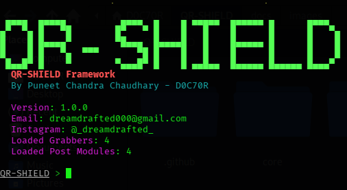

# QR-SHIELD



> **Security Research and Defense Framework for QR Code Threat Analysis**

---

## Status & Badges

[](LICENSE)
[](COMMERCIAL-LICENSE.md)
[](SECURITY.md)
[](https://www.python.org/downloads/)
[](README.md)

---

## Overview

QR-SHIELD is a research-grade Python framework for analyzing QR-code-related security risks and supporting defensive evaluation. It helps security researchers, detection engineers, and defensive practitioners study QR-code threat scenarios, develop validation methods, and improve awareness of emerging risks in the QR ecosystem.

**Core Mission:** Translate security research into practical defensive capability.

This project is built for:

- Security researchers analyzing QR code threats

- Detection engineers designing defensive signatures

- Academic institutions studying emerging attack patterns

- Authorized penetration testers validating defensive controls

- Cybersecurity professionals building threat intelligence

### Project Philosophy

QR-SHIELD operates on the principle that understanding relevant threat patterns is essential to building effective defenses. By studying how QR codes can be abused in controlled research settings, the project supports stronger detection systems, improved awareness, and more resilient security implementations.

---

## ⚠️ Legal and Ethical Notice

**This software is provided for authorized security research, defensive testing, and educational purposes only.**

### Prohibited Uses

Using QR-SHIELD for any of the following is strictly forbidden:

- Phishing campaigns or social engineering attacks

- Unauthorized credential exposure or session access

- Malware delivery or distribution

- Fraud or financial crimes

- Unauthorized access to systems or accounts

- Any illegal activity

**The author and contributors assume no responsibility for misuse or illegal activity conducted with this software.**

See [ETHICS.md](ETHICS.md), [DISCLAIMER.md](DISCLAIMER.md), and [SECURITY.md](SECURITY.md) for complete legal information.

---

## Features

### Core Capabilities

- **QR Code Session Acquisition**

  - Multi-platform support: Discord, WhatsApp, Signal, Telegram

  - XPath-based QR detection with cascading fallbacks

  - Automated QR refresh handling

  - Post-login session detection

- **Session Capture and Replay**

  - localStorage session capture (Discord, Signal, Telegram)

  - Profile-based session capture (WhatsApp)

  - Session restoration in isolated browsers

  - Interactive session manipulation

- **Browser Automation**

  - Selenium 4 integration with automated driver management

  - Firefox-based automation

  - User agent rotation

  - Headless and visible browser modes

- **Extensible Module System**

  - Plugin architecture for custom modules

  - Dynamic module discovery

  - Reusable execution contexts

  - Clean CLI integration

- **Research-Grade CLI Framework**

  - Interactive command shell

  - Command history and resource files

  - Debug, development, and verbose modes

  - Modular command system

- **HTTP Server Integration**

  - Template-based page serving

  - Dynamic port binding

  - Thread-safe operation

  - Jinja2 template support

---

## Architecture Overview

```text
QR-SHIELD
├── Core Runtime (Python 3.10+)
│   ├── Module System (Plugin Architecture)
│   │   ├── Grabber Modules (Session Acquisition)
│   │   └── Post Modules (Session Interaction)
│   ├── Browser Automation (Selenium 4)
│   ├── CLI Framework
│   └── Configuration System
├── Research Modules
│   └── Multi-platform Implementations
└── HTTP Server (Template Rendering)
```

See [ARCHITECTURE.md](ARCHITECTURE.md) for detailed technical breakdown.

---

## Use Cases

### Security Research

- Analyze QR code threat surfaces

- Develop threat detection signatures

- Study credential exposure scenarios

- Research emerging attack patterns

### Detection Engineering

- Build QR-based threat detection systems

- Develop behavioral analytics

- Create controlled security simulation environments

- Validate security controls

### Defensive Security

- Authorized penetration testing

- Security awareness training

- Defensive control validation

- Incident response planning

### Academic Research

- Study QR code security

- Analyze platform vulnerabilities

- Document security patterns

- Publish findings and recommendations

---

## Research Objectives

1. **Threat Analysis:** Characterize QR code attack vectors and threat models

1. **Detection Development:** Engineer detection mechanisms for QR-based threats

1. **Defensive Hardening:** Identify and implement defensive techniques

1. **Awareness:** Build security consciousness around QR code risks

1. **Knowledge Sharing:** Publish findings to advance the field

---

## Repository Structure

```text
qr-shield/
├── README.md                          # Project overview
├── ARCHITECTURE.md                    # Technical architecture
├── CONTRIBUTING.md                    # Contribution guidelines
├── CODE_OF_CONDUCT.md                 # Community standards
├── ETHICS.md                          # Ethical guidelines
├── SECURITY.md                        # Security policy
├── DISCLAIMER.md                      # Legal disclaimer
├── RESPONSIBLE_DISCLOSURE.md          # Vulnerability disclosure
├── THREAT_MODEL.md                    # Threat analysis
├── ROADMAP.md                         # Development roadmap
├── CHANGELOG.md                       # Version history
├── INSTALL.md                         # Installation guide
├── USAGE.md                           # Usage documentation
├── FAQ.md                             # Frequently asked questions
├── LICENSE                            # Community Research License
├── NOTICE                             # Dual Licensing Summary
├── COMMERCIAL-LICENSE.md              # Commercial licensing terms
│
├── core/                              # Main package
│   ├── app.py                         # Application entry point
│   ├── Cli.py                         # CLI dispatcher
│   ├── module.py                      # Module execution
│   ├── plugin_manager.py              # Module discovery
│   ├── browser.py                     # Selenium integration
│   ├── Settings.py                    # Settings loader
│   ├── ui.py                          # UI utilities
│   ├── color.py                       # Color definitions
│   ├── utils.py                       # Utility functions
│   ├── db.py                          # Database registry
│   │
│   ├── config/                        # Configuration system
│   │   ├── models.py                  # Config dataclasses
│   │   ├── loader.py                  # Config loader
│   │   └── defaults.py                # Default values
│   │
│   ├── modules/                       # Extensible module system
│   │   ├── grabber/                   # Session acquisition
│   │   │   ├── discord.py
│   │   │   ├── whatsapp.py
│   │   │   ├── signal.py
│   │   │   └── telegram.py
│   │   └── post/                      # Session interaction
│   │       ├── discord.py
│   │       ├── whatsapp.py
│   │       ├── signal.py
│   │       └── telegram.py
│   │
│   ├── registry/                      # Module registry
│   │   └── modules.py
│   │
│   ├── templates/                     # Jinja2 templates
│   │   └── phishing_page.html
│   │
│   ├── www/                           # Web assets
│   │   ├── discord/
│   │   ├── signal/
│   │   ├── telegram/
│   │   └── whatsapp/
│   │
│   └── Data/                          # Static data
│       ├── banners.txt
│       └── version.txt
│
├── docs/                              # Documentation
│   ├── architecture.md
│   ├── installation.md
│   ├── usage.md
│   ├── threat-model.md
│   ├── security.md
│   └── images/
│
├── tests/                             # Test suite
│   └── test_settings.py
│
├── sessions/                          # Session storage
├── profiles/                          # Browser profiles
├── pyproject.toml                     # Python project config
├── requirements.txt                   # Dependencies
└── qrshield.py                        # CLI entry point
```

---

## Quick Start

### Installation

**Prerequisites:**

- Python 3.10 or later

- Firefox browser

- pip package manager

**Basic Installation:**

```bash
git clone https://github.com/dreamed000/QR-SHIELD.git
cd qr-shield
pip install -r requirements.txt
python qrshield.py
```

For development and contribution, install the optional dev dependencies:

```bash
pip install -e ".[dev]"
```

See [INSTALL.md](INSTALL.md) for detailed installation instructions.

### First Run

```bash
python qrshield.py
```

You will see the QR-SHIELD banner and an interactive prompt. From there, you can use commands such as help, list, use, options, set, run, and sessions.

Example workflow:

```text
qrshield> list
qrshield> use grabber/discord
qrshield> run
```

### Help System

```text
qrshield> help
qrshield> list
qrshield> info grabber/discord
qrshield> use grabber/discord
```

---

## Configuration

### Environment Variables

- `QRSHIELD_FIREFOX_BINARY` - Firefox executable path

- `FIREFOX_BINARY` - Fallback Firefox path

- `WSL_DISTRO_NAME` - WSL detection

On Windows PowerShell, the same setting can be applied at runtime with:

```powershell
$env:QRSHIELD_FIREFOX_BINARY = "C:\path\to\firefox.exe"
```

### Runtime Modes

```bash
python qrshield.py --debug      # Debug mode with tracebacks
python qrshield.py --dev        # Development mode with module reload
python qrshield.py --verbose    # Verbose logging
python qrshield.py -q           # Quiet mode (no banner)
```

### Resource Files

Execute commands from file:

```bash
python qrshield.py -r commands.rc
```

### Direct Command Execution

```bash
python qrshield.py -x "use grabber/discord; run"
```

---

## Threat Model

QR-SHIELD implements research into the following threat scenarios:

1. **Session Exposure via QR Code**

   - Observing active sessions during QR-based authentication

   - Evaluating secondary verification controls

1. **Credential Exposure Analysis**

   - Reviewing exposure paths from captured sessions

   - Understanding token management risks

1. **Post-Exposure Assessment**

   - Evaluating behavior after session exposure

   - Understanding platform response patterns

1. **Attack Surface Analysis**

   - Identifying QR-specific security considerations

   - Documenting platform-specific weaknesses

See [THREAT_MODEL.md](THREAT_MODEL.md) for complete threat analysis.

---

## Security Considerations

### Design Principles

1. **Isolation:** Research activities should be conducted in isolated, controlled environments

1. **Visibility:** Operations should be traceable and auditable

1. **Containment:** No persistent changes to systems under evaluation

1. **Consent:** Only use against systems you own or have explicit authorization to test

### Responsible Use

- Only operate on systems you control or have written authorization to test

- Inform relevant parties before conducting authorized testing

- Document all testing activities

- Report findings through responsible disclosure channels

- Never conduct unauthorized access

See [SECURITY.md](SECURITY.md) and [RESPONSIBLE_DISCLOSURE.md](RESPONSIBLE_DISCLOSURE.md).

---

## Documentation

| Document | Purpose |
| --- | --- |
| [README.md](README.md) | Project overview and quick start |
| [ARCHITECTURE.md](ARCHITECTURE.md) | Technical architecture and design |
| [INSTALL.md](INSTALL.md) | Installation and setup |
| [USAGE.md](USAGE.md) | Detailed usage documentation |
| [THREAT_MODEL.md](THREAT_MODEL.md) | Threat analysis and attack vectors |
| [SECURITY.md](SECURITY.md) | Security policy and considerations |
| [ETHICS.md](ETHICS.md) | Ethical guidelines and principles |
| [DISCLAIMER.md](DISCLAIMER.md) | Legal disclaimer |
| [RESPONSIBLE_DISCLOSURE.md](RESPONSIBLE_DISCLOSURE.md) | Vulnerability disclosure process |
| [FAQ.md](FAQ.md) | Frequently asked questions |
| [CONTRIBUTING.md](CONTRIBUTING.md) | Contribution guidelines |
| [CODE_OF_CONDUCT.md](CODE_OF_CONDUCT.md) | Community standards |

---

## Contributing

QR-SHIELD welcomes contributions from the security research community. See [CONTRIBUTING.md](CONTRIBUTING.md) for guidelines.

### Areas for Contribution

- Additional platform modules (Instagram, LinkedIn, etc.)

- Defensive detection techniques

- Research and documentation improvements

- Documentation improvements

- Test coverage expansion

- Bug reports and fixes

---

## Roadmap

### Version 1.0.0 (First Public Release)

- ✅ First public GitHub release

- ✅ Modern Python packaging and developer workflow

- ✅ Python 3.10+ support

- ✅ Multi-platform support (Discord, WhatsApp, Signal, Telegram)

### Planned Features

See [ROADMAP.md](ROADMAP.md) for detailed development plans.

---

## Versioning

QR-SHIELD follows [Semantic Versioning](https://semver.org/).

**Version Format:** `MAJOR.MINOR.PATCH`

- **MAJOR:** Breaking changes or significant rewrites

- **MINOR:** New features or substantial improvements

- **PATCH:** Bug fixes and minor improvements

See [CHANGELOG.md](CHANGELOG.md) for version history.

---

## Citation

If you use QR-SHIELD in your research, please cite:

```bibtex
@software{qrshield2026,
  author = {Chaudhary, Puneet Chandra},
  title = {QR-SHIELD: Security Research Framework for QR Code Threat Analysis},
  year = {2026},
  version = {1.0.0},
  url = {https://github.com/dreamed000/QR-SHIELD},
  note = {First public release}
}
```

See [CITATION.cff](CITATION.cff) for additional citation formats.

---

## License

QR-SHIELD is distributed under a professional Dual Licensing Model.

- **Community Research License** — free for licensed academic, educational, cybersecurity research, defensive security, authorized penetration testing, CTF, and internal security assessment use.

- **Commercial License** — required for commercial integration, SaaS, consulting, managed security services, OEM licensing, enterprise deployment, or redistribution.

This repository is not released under MIT, Apache, GPL, BSD, or any standard OSI license. See [LICENSE](LICENSE) and [COMMERCIAL-LICENSE.md](COMMERCIAL-LICENSE.md) for complete licensing terms.

---

## Author

**Puneet Chandra Chaudhary**

- GitHub: [@dreamed000](https://github.com/dreamed000)

- Email: dreamdrafted000@gmail.com

- ORCID: [0009-0005-7220-2327](https://orcid.org/0009-0005-7220-2327)

---

## Support

### Getting Help

- **Documentation:** See [docs/](docs/) directory

- **FAQ:** Check [FAQ.md](FAQ.md)

- **Issues:** Report bugs on [GitHub Issues](https://github.com/dreamed000/QR-SHIELD/issues)

- **Security:** Report vulnerabilities in [SECURITY.md](SECURITY.md)

See [SUPPORT.md](SUPPORT.md) for support channels.

---

## Acknowledgements

QR-SHIELD builds on the following open-source projects:

- **Selenium** - Browser automation framework

- **Jinja2** - Template rendering engine

- **Pillow** - Image processing dependency used for screenshot capture and image handling

- **requests** - HTTP library

See [ACKNOWLEDGEMENTS.md](ACKNOWLEDGEMENTS.md) for complete attribution.

---

## Sponsors

This project is maintained by individual contributors. Sponsorship helps sustain:

- Security research and development

- Tool maintenance and bug fixes

- Documentation and educational materials

- Community support and engagement

### Support QR-SHIELD

- [GitHub Sponsors](https://github.com/sponsors/dreamed000) - Primary sponsorship platform

- [Patreon](https://patreon.com/dreamed000) - Recurring support

Your support directly enables continued security research and community benefit.

---

## Disclaimer

This software is provided "as-is" without warranty or liability. Use is at your own risk and subject to applicable laws and regulations. The author assumes no responsibility for misuse, damage, or illegal activity.

See [DISCLAIMER.md](DISCLAIMER.md) for complete legal terms.

---

## Status

**Project Status:** Active Development and Maintenance

- Security: Actively maintained

- Documentation: Regularly updated

- Bug fixes: Prioritized

- Features: Community-driven

---

**Last Updated:** July 2026

**Repository:** [github.com/dreamed000/QR-SHIELD](https://github.com/dreamed000/QR-SHIELD)
