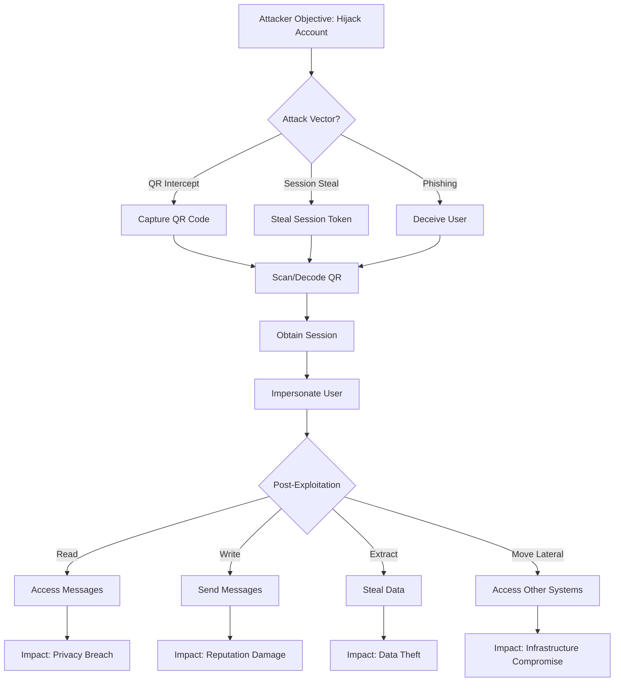

# Threat Model

## Overview

This document describes the threat model, security assumptions, and threat scenarios that QR-SHIELD is intended to study and help defend against. Understanding the threat model is essential for responsible and authorized use.

## Purpose of This Document

The threat model explains:

1. **What we protect against** - Attack scenarios this tool is designed to study

1. **What we assume** - Security assumptions underlying the framework

1. **What we don't address** - Out-of-scope threats

1. **What we enable** - Capabilities and risks

1. **How to use safely** - Recommendations for defensive operations

## Threat Scope

### In Scope: QR-Code Based Session Hijacking

QR-SHIELD focuses on understanding and defending against QR code-based threat scenarios:

#### Attack Vector 1: QR Code Interception During Login

**Threat:** An unauthorized actor captures a QR code during a login attempt

```text
User → Opens WhatsApp Web → QR Code Displayed
↓
Attacker captures QR image
↓
Attacker scans QR → Gets session token
↓
Attacker hijacks session
```

**Defense Implications:**

- Understand how platforms use QR codes

- Identify when hijacking occurs

- Develop detection for abnormal access

- Design better QR alternatives

#### Attack Vector 2: Man-in-the-Middle (MITM) QR Capture

**Threat:** A network-based actor captures QR or session data

```text
User on Coffee Shop WiFi → Logs in to WhatsApp Web
↓
Attacker intercepts traffic → Captures session tokens
↓
Attacker accesses account
```

**Defense Implications:**

- Detect session hijacking

- Build behavioral detection

- Identify unusual locations/devices

- Improve encryption/verification

#### Attack Vector 3: Phishing QR Codes

**Threat:** A user follows a misleading QR-based sign-in prompt instead of a legitimate platform flow

```text
User receives phishing message with QR code
↓
User scans what they think is Discord login QR
↓
Actually redirects to credential capture page
↓
Credentials stolen
```

**Defense Implications:**

- Educate users on QR verification

- Detect credential theft attempts

- Build QR verification mechanisms

- Improve user awareness

#### Attack Vector 4: Account Compromise via Stolen Sessions

**Threat:** An unauthorized actor uses an exposed session to impersonate a user

```text
Attacker has session token → Accesses Discord as victim
↓
Send messages impersonating victim
↓
Access private messages
↓
Steal information or manipulate relationships
```

**Defense Implications:**

- Detect anomalous session usage

- Implement session anomaly detection

- Add step-up authentication

- Improve account recovery

#### Attack Vector 5: Credential Extraction

**Threat:** An unauthorized actor extracts stored credentials from an exposed session

```text
Attacker loads hijacked session → Accesses account
↓
Extracts API tokens, settings, saved data
↓
Uses credentials for lateral movement
↓
Compromises other systems
```

**Defense Implications:**

- Understand credential storage

- Identify extraction techniques

- Monitor for credential access

- Implement credential protection

### Attack Lifecycle

```text
Discovery → QR Location → Capture → Hijack → Post-Exploitation
   ↓            ↓            ↓        ↓            ↓
Research   DOM Analysis   Timing    Timing      Session Use
Platforms  Selectors     Handling   Handling    Manipulation
```

## Threat Actors

### Who Are We Defending Against?

QR-SHIELD focuses on defensive strategies for:

| Actor Type | Capability | Motivation |
| --- | --- | --- |
| **Opportunistic Attackers** | Low skill, script-based | Credential harvesting, account takeover |
| **Skilled Attackers** | Advanced techniques, evasion | Targeted attacks, espionage |
| **Organized Crime** | Sophisticated, resourced | Fraud, credential trafficking |
| **Nation States** | Advanced, coordinated | Espionage, disruption |

Our focus is enabling defenders to understand and protect against these actors.

## Attack Flow Diagram



## Security Assumptions

### Assumptions About Platforms

We assume:

1. **QR Codes are actively transmitted** - Platform continuously displays QR

1. **Session tokens are sufficient for access** - No additional verification after login

1. **Session data is stored client-side** - localStorage or cookies

1. **User agents are identifiable** - Unusual agents trigger alerts (or should)

1. **Geographic/timing anomalies exist** - Can detect suspicious login patterns

1. **Platform maintains access logs** - Allows forensic analysis

### Assumptions About Attackers

We assume:

1. **Attackers have network access** - Can capture traffic or DOM

1. **Attackers have time to prepare** - Not millisecond-scale race conditions

1. **Attackers use observable methods** - Not quantum teleportation

1. **Attackers want to remain hidden** - Eventually detected is acceptable

1. **Attackers are resource-constrained** - Prefer simple, reliable attacks

### Assumptions About Defenders

We assume:

1. **You own systems or have authorization** - Testing is legitimate

1. **You understand legal implications** - Responsible use

1. **You will handle data carefully** - Protect captured sessions

1. **You follow responsible disclosure** - Report findings properly

1. **You support defensive security** - Goal is to improve defenses

## Threat Not Addressed

### Out of Scope

These threats are NOT directly addressed by QR-SHIELD:

#### Platform-Level Vulnerabilities

- Zero-day exploits in Discord/WhatsApp servers

- Platform encryption weaknesses

- Backend infrastructure attacks

- Platform insider threats

**Why:** Platform vulnerabilities should be reported to vendors, not exploited with QR-SHIELD.

#### Endpoint Security

- Browser vulnerabilities

- Operating system exploits

- Malware or trojans

- Keystroke logging

**Why:** These are orthogonal to QR-code attacks.

#### Social Engineering (Non-QR)

- Phishing emails

- Phone calls/vishing

- Pretexting

- Physical security

**Why:** QR-SHIELD is QR-specific.

#### Supply Chain Attacks

- Malicious dependencies

- Compromised packages

- Build system attacks

**Why:** These affect QR-SHIELD itself, handled separately.

#### Legal/Regulatory

- Compliance violations

- Policy breaches

- Acceptable use violations

**Why:** User's responsibility, not QR-SHIELD's.

## Risk Matrix

### Likelihood vs. Impact

```text
┌─────────────────────────────────────────┐
│ Risk Level by Likelihood & Impact       │
├─────────────────────────────────────────┤
│                                         │
│ High Impact:   [Rare] [High] [Critical] │
│                                         │
│ Med Impact:    [Low]  [Med]  [High]     │
│                                         │
│ Low Impact:    [Low]  [Low]  [Med]      │
│                                         │
│                Rare  Medium  Likely     │
│                                         │
└─────────────────────────────────────────┘
```

### Risk Categories

| Risk | Likelihood | Impact | Mitigation |
| --- | --- | --- | --- |
| QR interception | **High** | **High** | Defender awareness, MFA |
| Session hijacking | **High** | **High** | Anomaly detection, step-up auth |
| Phishing QR | **Medium** | **Medium** | User training, verification |
| Credential extraction | **Medium** | **High** | Credential protection |
| Lateral movement | **Low** | **High** | Network segmentation |

## Defense Strategies

### Detection

Defenders should implement:

1. **Behavioral Anomaly Detection**

   - Login from unexpected locations

   - Login at unusual times

   - Access patterns change

   - Device/browser changes

1. **Session Anomaly Detection**

   - Multiple simultaneous sessions

   - Session usage from different locations

   - Rapid session creation/destruction

   - Unusual API calls

1. **Traffic Analysis**

   - Unusual request patterns

   - Bot-like behavior

   - Automated account operations

   - Data exfiltration patterns

### Prevention

Defenders should implement:

1. **Strong Authentication**

   - Multi-factor authentication (MFA)

   - FIDO2 hardware keys

   - Biometric verification

   - Certificate-based auth

1. **Session Management**

   - Short session lifetimes

   - Session pinning

   - Device binding

   - Continuous verification

1. **User Awareness**

   - QR code verification training

   - Phishing simulation

   - Incident reporting education

   - Security best practices

### Response

If account is compromised:

1. **Immediate Actions**

   - Force logout all sessions

   - Disable authentication tokens

   - Quarantine account

   - Alert user

1. **Investigation**

   - Review login history

   - Check for lateral movement

   - Identify data accessed

   - Determine entry vector

1. **Recovery**

   - Password reset

   - Credential rotation

   - MFA re-enrollment

   - Account restoration

## Misuse Scenarios

### Scenario 1: Phishing Campaign

**Attack:** Attacker uses QR-SHIELD to conduct large-scale phishing

```text
Attacker → Uses QR-SHIELD to capture sessions
         → Sells or uses credentials
         → Compromises thousands of accounts
```

**Impact:** Massive credential theft, fraud, privacy breaches

**Prevention:**

- QR-SHIELD comes with strong ethical warnings

- Responsible disclosure of bugs prevents weaponization

- Community education discourages misuse

- Law enforcement can investigate abuse

### Scenario 2: Insider Threat

**Attack:** Disgruntled employee uses QR-SHIELD against coworkers

```text
Employee → Uses QR-SHIELD on corporate Discord
        → Accesses confidential channels
        → Extracts trade secrets
```

**Impact:** IP theft, competitive disadvantage, trust violation

**Prevention:**

- Organization controls QR-SHIELD access

- Audit logs reveal misuse

- Anomaly detection catches abuse

- Internal investigation procedures

### Scenario 3: Nation State Targeting

**Attack:** Nation state uses QR-SHIELD as part of targeted attack

```text
Nation State → Identifies target
            → Uses QR-SHIELD to capture session
            → Gains access to communications
            → Launches second-stage attack
```

**Impact:** Espionage, operational security compromise

**Prevention:**

- High-security users use hardware security keys

- Behavioral detection of state-level attackers

- Incident response procedures

- Law enforcement involvement

## Limitations

Users should understand QR-SHIELD's limitations:

### Detection Evasion

- QR-SHIELD may not evade all defensive measures

- Platforms continuously improve detection

- Behavioral analysis may flag QR-SHIELD activity

- No guarantee of undetectability

### Platform Resilience

- Platforms regularly update QR code generation

- XPath selectors become outdated

- DOM structure changes frequently

- QR-SHIELD may not work with latest updates

### Legal Constraints

- Unauthorized use is illegal in most jurisdictions

- Terms of service prohibit session capture

- Regulated industries have stricter requirements

- Consequences include criminal liability

## Threat Evolution

### Historical QR Attacks

- 2019: QR code phishing begins

- 2020: Session hijacking via QR codes documented

- 2021: Widespread QR malware campaigns

- 2023: Increased platform QR security hardening

- 2024: AI-generated QR phishing

### Future Threats

Emerging attacks may include:

- AI-powered phishing optimization

- Deepfake-based social engineering

- Cross-platform session linking

- Cryptographic vulnerability discovery

### Platform Defenses

Platforms are actively improving:

- Per-session security tokens

- Device fingerprinting

- Geolocation verification

- Behavioral AI detection

- Hardware security key support

- Passwordless authentication

## Recommendations

### For Researchers

1. **Understand the threat model** - Know what you're defending against

1. **Use responsibly** - Only for authorized testing

1. **Coordinate disclosure** - Report findings properly

1. **Advance defense** - Focus on defensive capability

1. **Publish responsibly** - Help the community improve

### For Defenders

1. **Implement layered defense** - Don't rely on single controls

1. **Monitor actively** - Behavioral detection is key

1. **Train users** - Awareness reduces attack surface

1. **Plan for breach** - Assume attackers will get in

1. **Improve quickly** - Platforms change, defenses must adapt

### For Organizations

1. **Conduct risk assessment** - Understand your exposure

1. **Deploy controls** - Implement detection and prevention

1. **Authorize testing** - Use QR-SHIELD only with permission

1. **Document procedures** - Clear incident response plans

1. **Stay updated** - Platforms and threats evolve

---

## Threat Model References

- STRIDE threat modeling methodology

- OWASP Top 10

- NIST Cybersecurity Framework

- ATT&CK Framework

---

**Last Updated:** July 2026

**This threat model is a living document. Review regularly for updates.**
